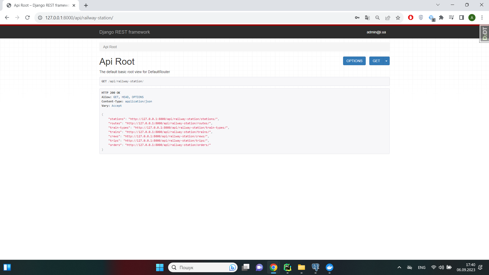
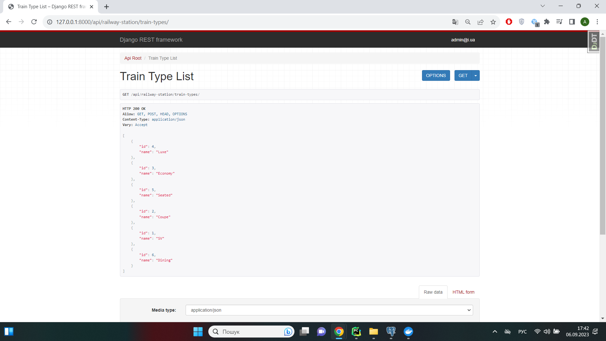
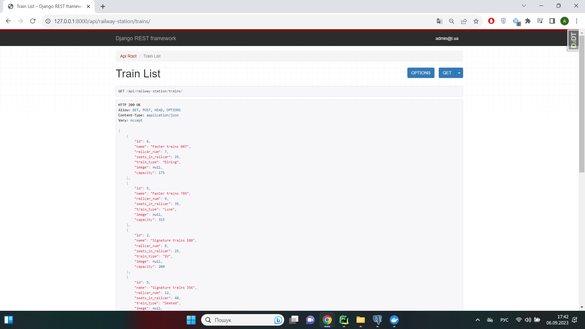
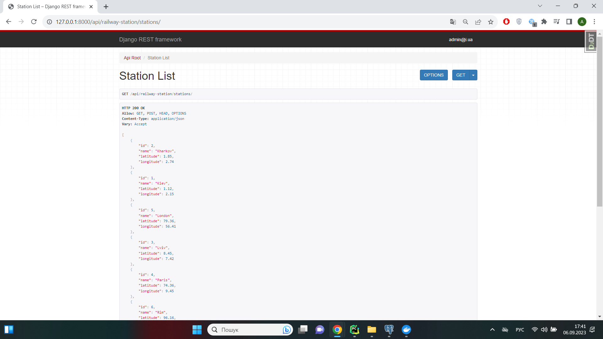
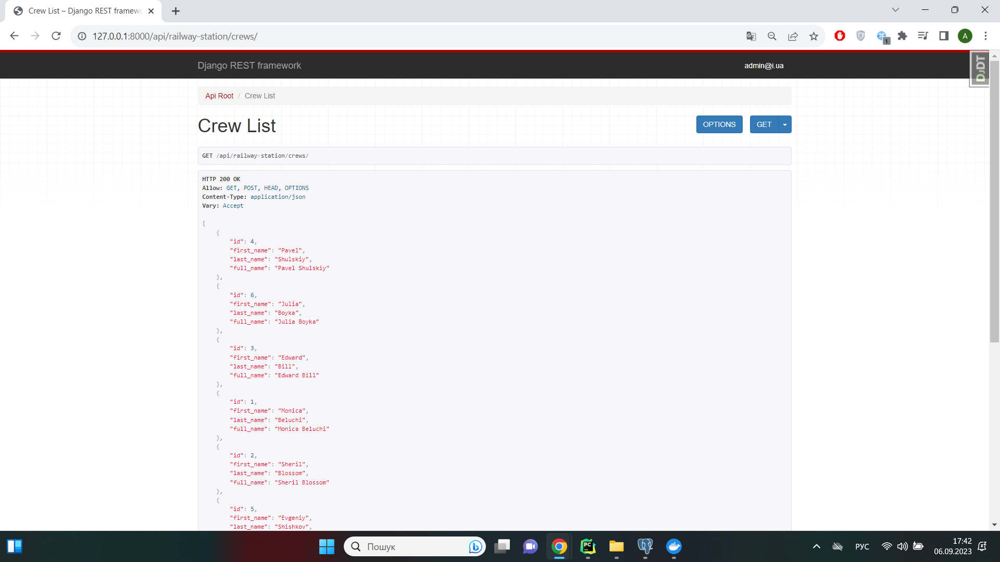
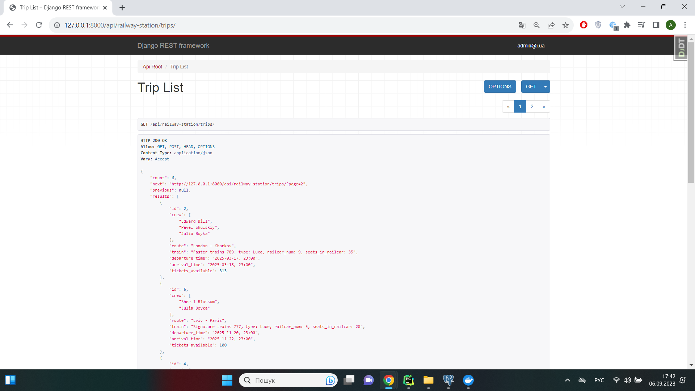
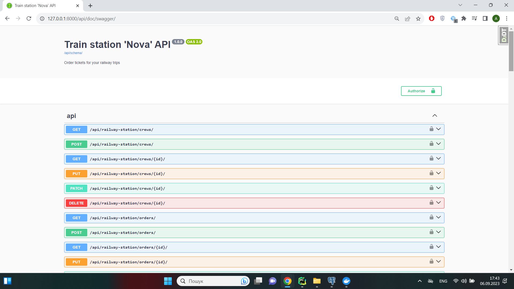
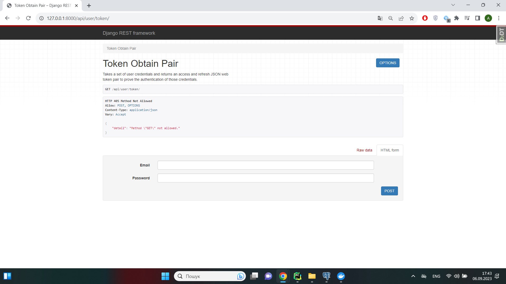
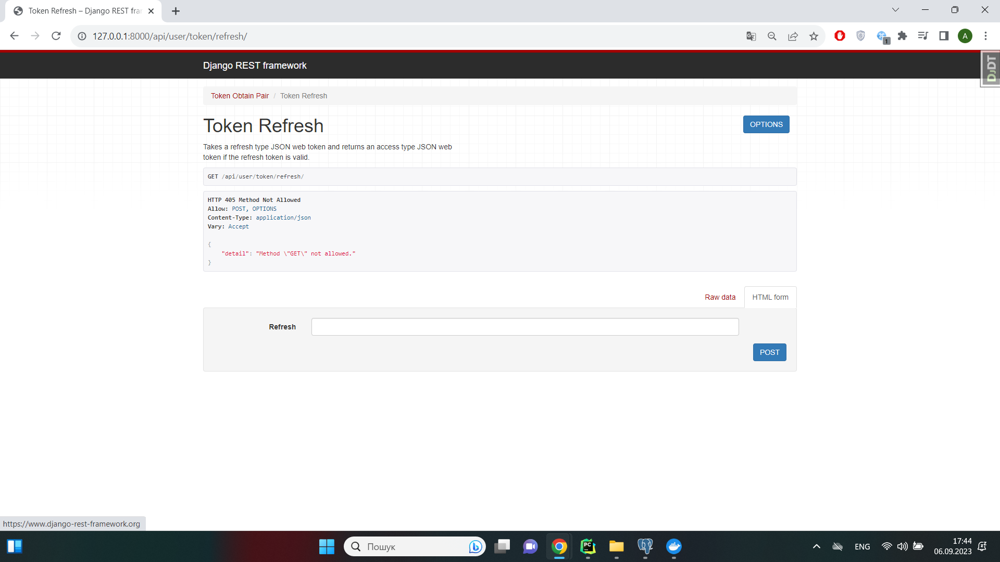

# Train station Nova Management API

The Train station Management API is a Django-based web 
application designed to facilitate the management of trains, 
trips, tickets reservations, and related data for a train 
station. Anonymous users can only view this API. Provides 
administrators and authenticated users with different 
endpoints to interact with the system. It includes features 
such as browsing and filtering, trip management, reservations, 
and more.

## Getting Started

### Prerequisites

Before you begin, make sure you have the following tools 
and technologies installed:

- Python (>=3.11)
- Django
- Django REST framework

## Installing:

### - Using Git

1. Clone the repo:

```
git clone https://github.com/Niki-Alex/train-station-nova.git
```

2. You can open project in IDE and configure .env file using 
[.env.sample](./.env.sample) file as an example.

<details>
  <summary>Parameters for .env file:</summary>
  
  - DJANGO_SECRET_KEY: ```Your django secret key, you can 
generate one on https://djecrety.ir```
  - POSTGRES_DB: ```Name of your DB```
  - POSTGRES_USER: ```Name of your user for DB```
  - POSTGRES_PASSWORD: ```Your password in DB```
  - POSTGRES_HOST ```Host of your DB```
</details>

3. Run docker-compose command to build and run containers:

```
docker-compose up --build
```

### - Using Docker Hub

1. Login into the Docker:

```
docker login
```

2. Pull the project:

```
docker pull nikiforenkoas/train_station_api_service
```

3. Run the containers:

```
docker-compose up
```

> To access browsable api, use http://localhost:8000/api/railway-station/
>
> To get access to the content, visit http://localhost:8000/api/user/token/ to get JWT token.
>
> Use the following admin user:
> - Email: admin@i.ua
> - Password: defi4637

## API Endpoints

<details>
  <summary>Stations</summary>

- List Stations: ```GET /api/railway-station/stations/```
- Create Station: ```POST /api/railway-station/stations/```
- Retrieve Station: ```GET /api/railway-station/stations/{station_id}/```
- Update Station: ```PUT /api/railway-station/stations/{station_id}/```
- Partial Update ```PATCH /api/railway-station/stations/{station_id}/```
- Delete Station: ```DELETE /api/railway-station/stations/{station_id}/```
</details>

<details>
  <summary>Routes</summary>

- List Routes: ```GET /api/railway-station/routes/```
- Create Route: ```POST /api/railway-station/routes/```
- Retrieve Route: ```GET /api/railway-station/routes/{route_id}/```
- Update Route: ```PUT /api/railway-station/routes/{route_id}/```
- Partial Update ```PATCH /api/railway-station/routes/{route_id}/```
- Delete Route: ```DELETE /api/railway-station/routes/{route_id}/```
</details>

<details>
  <summary>Train types</summary>

- List Train types: ```GET /api/railway-station/train-types/```
- Create Train type: ```POST /api/railway-station/train-types/```
- Retrieve Train type: ```GET /api/railway-station/train-types/{train-type_id}/```
- Update Train type: ```PUT /api/railway-station/train-types/{train-type_id}/```
- Partial Update ```PATCH /api/railway-station/train-types/{train-type_id}/```
- Delete Train type: ```DELETE /api/railway-station/train-types/{train-type_id}/```
</details>

<details>
  <summary>Trains</summary>

- List Trains: ```GET /api/railway-station/trains/```
- Create Train: ```POST /api/railway-station/trains/```
- Retrieve Train: ```GET /api/railway-station/trains/{train_id}/```
- Update Train: ```PUT /api/railway-station/trains/{train_id}/```
- Partial Update ```PATCH /api/railway-station/trains/{train_id}/```
- Delete Train: ```DELETE /api/railway-station/trains/{train_id}/```
- Image Upload ```POST /api/railway-station/trains/{train_id}/```
</details>

<details>
  <summary>Crews</summary>

- List Crews: ```GET /api/railway-station/crews/```
- Create Crew: ```POST /api/railway-station/crews/```
- Retrieve Crew: ```GET /api/railway-station/crews/{crew_id}/```
- Update Crew: ```PUT /api/railway-station/crews/{crew_id}/```
- Partial Update ```PATCH /api/railway-station/crews/{crew_id}/```
- Delete Crew: ```DELETE /api/railway-station/crews/{crew_id}/```
</details>

<details>
  <summary>Trips</summary>

- List Trips: ```GET /api/railway-station/trips/```
- Create Trip: ```POST /api/railway-station/trips/```
- Retrieve Trip: ```GET /api/railway-station/trips/{trip_id}/```
- Update Trip: ```PUT /api/railway-station/trips/{trip_id}/```
- Partial Update ```PATCH /api/railway-station/trips/{trip_id}/```
- Delete Trip: ```DELETE /api/railway-station/trips/{trip_id}/```
</details>

<details>
  <summary>User</summary>

- Information about current User: ```GET /api/user/profile/```
- Update User: ```PUT /api/user/profile/```
- Partial Update: ```PATCH /api/user/profile/```
- Create new User: ```POST /api/user/register/```
- Create access and refresh tokens: ```POST /api/user/token/```
- Refresh access token: ```POST /api/user/token/refresh/```
- Verify tokens: ```POST /api/user/token/verify/```
</details>


## Authentication

- The API uses token-based authentication for user access. 
Users need to obtain an authentication token when logging in.
- Administrators, authenticated users, and anonymous users can 
access all endpoints, but only an administrator can change 
information about trains, trips, routes, etc. However, each 
authenticated and anonymous user can access and create their 
own reservations.

## Documentation

- The API is documented using the OpenAPI standard.
- Access the API documentation by running the server and 
navigating to http://localhost:8000/api/doc/swagger/ or 
http://localhost:8000/api/doc/redoc/.

## DB Structure


## Endpoints













